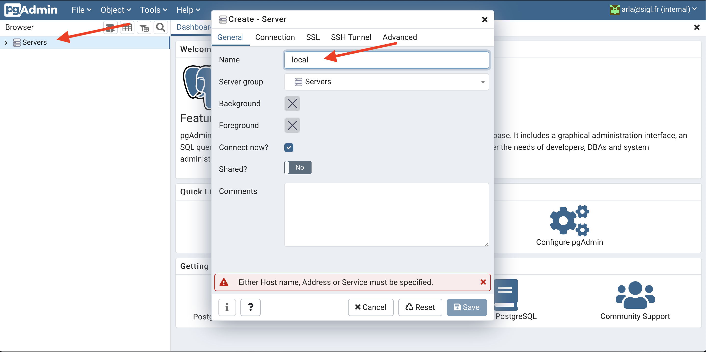

# Postgres (or PostgreSQL) workshop

[Postgres](https://www.postgresql.org) is an open source relationnal database managment system (RDBMS).

It's totally free and is use in production by many. This is the brother of MySQL/MariaDB.

In this workshop, you will:
- create Arlaide's database schema
- import test data
- visualize this data using [pgAdmin](https://www.pgadmin.org)
- query some data from the web API of the former workshop

## Step 1: Run Postgres and pgadmin on your computer

Postgres is your relationnal database where pgAdmin is a simple UI to help you manage your database (query, table creation etc...).

Instead of installing directly Postgres and pgAdmin on your local machine, you will run those in containers.

### docker-compose, docker network and docker volumes

You will use another tool in the docker world: [docker-compose](https://docs.docker.com/compose/).

`docker-compose` is a CLI tool that allows you to run multiple containers, describe in a `docker-compose.yaml` (or `docker-compose.yaml`)file.

We've created the [docker-compose.yaml](./docker-compose.yaml) for you.

Because pgAdmin docker image needs to access postgres docker image, they need to be on the same [docker network](https://docs.docker.com/network/).

First, create a new external docker network for postgres:
```sh
# creates the postgres docker network
docker network create arlaide-postgres
```

Second, create two [docker volumes](https://docs.docker.com/storage/volumes/):
- postgres-data: to store postgres data to avoid losing it every time your restart postgres container
- pgadmin-data: to store pgAdmin configurations, to avoid losing your config every time you restart pgAdmin container

```sh
# create postgres-data volume
docker volume create postgres-data
# create pgadmin-data volume
docker volume create pgadmin-data
```

Then, you can just run containers describe in `docker-compose.yaml` by typing:
```sh
# start containers describe in the docker-compose.yaml file
# in daemon mode. Meaning, you'll start your containers in background
docker-compose up -d
# Creating pgadmin4    ... done
# Creating postgres-13 ... done
```

Check if your containers are running:
```sh
docker ps
# you should see your two containers in the list
```

> Note: if you need to redo or delete evrything:
> - `docker-compose down` will remove all running container but NOT volumes and network, since they are external
> - `docker volume rm postgres-data` to delete postgres data
> - `docker volume rm pgadmin-data` to delete pgadmin data
> - `docker network rm arlaide-postgres` to delete postgres's docker network

### Connect to your database with pgAdmin

You should be able to access PgAdmin on [locahost:8040](http://localhost:8040/)
- usermail: arla@sigl.fr
- password: sigl2021

For PostgreSQL instance running locally, credentials are:
- user: sigl2021
- password: sigl2021

> Note: default credentials are in the docker-compose file

Once logged in add the local PostgreSQL:
1. Add server: right click on Servers > Add server
2. Enter a connection name (e.g. local)

3. Add the postgres containers info (user, password are both sigl2021)

4. You should see postgres schema and sigl2020 schema in the server dropdown:


## Step 2: Create Arlaide's database schema

First, let's create a database named `arlaide`, using pgAdmin:
- right click on `Databases` under Server > local
- select `Create`
- just set the name to `arlaide` and some comment if you want.
> Note: if you currious about how to do it in raw SQL, you can see real SQL code in the SQL tab
- click `Save`


Then, let's create Arlaide's database core schema, with the following specifications:
- A **user** has one or more **skills**.
- A **skill** express what the a **user** is good at.
- A **user** creates **help requests** at a given date and time.
- A **user** can apply to one or more **help_requests**
- A **help request** is associated to a single **location** .
- A **user** can work in one or many **location**.
- A **help request** has one or more **reward**.
- A **reward** can be money in a specific currency and/or credibility points. The more credibility points a user has, better his chance of getting selected for a request.

Here is the corresponding entity-relation diagram (ERD), without table attributes:


We've prepared a script to create those tables: [create-table.sql](./scripts/create-tables.sql).

To run it, you need to send it to your docker container and run a `psql` command from there:
```sh
# First copy the `create-table.sql` script to your running postgres container
docker cp ./scripts/create-tables.sql postgres-13:/tmp/
# create tables by running the create-table scripts over
# your arlaide database
docker exec -it postgres-13 psql -U sigl2021 -d arlaide -f /tmp/create-tables.sql
```

You should see your tables in pgAdmin, under:
Server > local > databases > arlaide > Schemas > public > Tables

Now we've created all tables, we need to add some data to it.

## Step 3: Import data to your database

You will use the [COPY](https://www.postgresql.org/docs/12/sql-copy.html) command of postgres to import some data that we provided to you.

### Import users

We copied an open dataset from the website [data.world](https://data.world), containing 70k+ usernames.

To import it to your postgres database:
1. copy the [usernames.csv](./scripts/usernames.csv) file to the running docker container
2. import the csv file to your `arlaide` database:
```sh
# import csv using COPY command from the postgresql container
docker exec -it postgres-13 psql -U sigl2021 -d arlaide -c "COPY users(username) FROM '/tmp/usernames.csv' DELIMITER ',' CSV HEADER;"
```

### Import locations


### Import help requests

You will use a dataset of 30 000 job offers in medical industry to simulate user's requests.

> Note: Original dataset can be found here: https://data.world/promptcloud/30000-latest-job-postings-from-emedcareers-europe/workspace/file?filename=emed_careers_eu.csv


## Step 4: Create some views on your data


